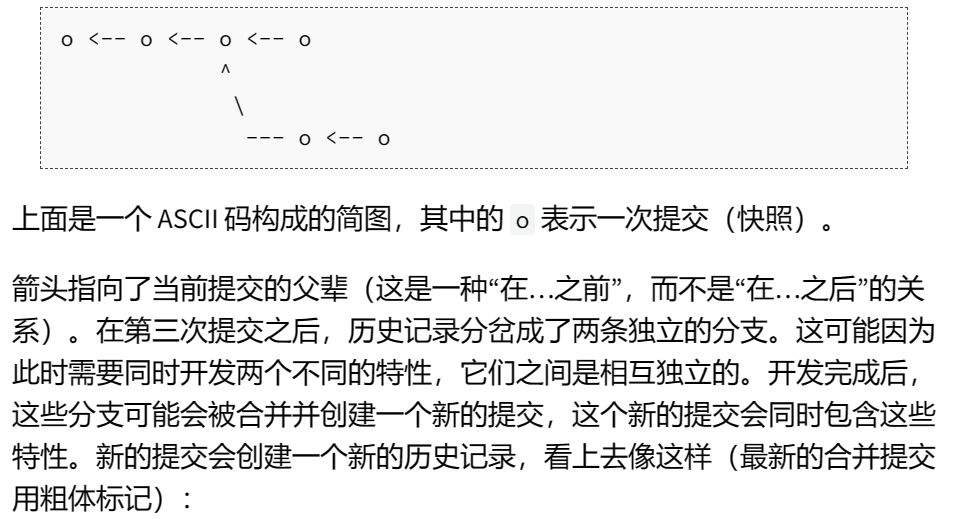

##GIT介绍

GIT能帮我们轻松的管理我们的项目。能够解决以下的问题：
- 当前模块是谁写的？
- 这个文件的某行是谁编写的，什么时候编写的？修改原因是什么？
- 最近的所有版本中，何时/为什么导致了单元测试失败？

GIT丑陋的接口只能靠死记硬背，但是==它的底层设计确实十分优雅的==。我们先从数据模型开始在学习它的操作。

---
###GIT的数据类型。
####快照

在GIT的术语中，==文件被称作Blob对象，目录被称之为树==。快照则是被追踪的最顶层的树。

树的实例：


####历史记录建模：关联快照

在GIT中，**历史记录是一个由快照组成的有向无环图**（即每一个快照都有一系列的父辈，==注意快照具有多个父辈而不是一个==，因为快照可能由多个父辈而来，例如合并后的两条分支）

在git中快照被称之为‘commit’。提交的简图如下：


伪代码的形式来学习git的数据模型：


---
###引用
在GIT中，我们用它们的**SHA-1哈希值**来标记快照。但这很不方便。

GIT给出的解决方法是引用，它是指向提交的指针。在GIT中，指向我们当前位置有一个特殊的索引，它就是‘HEAD’。

###基础操作
- git init：   创建一个git仓库，数据会存储在一个名为.git的目录下
- git status：  显示当前的仓库状态
- git add<filename>：添加文件到暂存区
- git commit：创建一个新的提交。
- git log：显示修改历史
- git log --all --graph --decorate：可视化历史记录（有向无环图）
- git diff <filename> 显示与暂存文件的差异
- git diff <version><filename>：显示某两个版本之间的差异
- git checkout <revision>：更新HEAD和目前的分支为revision

####分支和合并

- git branch： 显示分支
- git branch<name>:创建分支。
- git checkout -b <name>：创建分支并切换到该分支。
- git merge<revision>:合并到当前分支
- git mergetool：使用工具来处理合并冲突
  
###远端操作

- git remote：列出远端
- git remote add <name> <url>:添加一个远端
- git push <remote><local branch>:<remote branch>:将对象传送至远端并更新远端引用。
- git fetch：从远端获取对象/索引

---
#git的使用

##创建仓库
创建仓库的两种常见的方式：
1. 将尚未进行版本控制的本地文件目录转为GIT仓库
2. 从其它服务器克隆一个已存在的Git仓库
==两种方式都会在本地机器上得到一个工作就绪的GIT仓库==

###在已存在目录上初始化仓库s
切换到目录后
```
git init
```
会创造一个.git的子目录，这个子目录含有你初始化的Git仓库的必要文件，但是一开始是空的，我们需要追踪文件来进行初始化，然后commit。
```
git add .c
git commit -m 'intial project version'
```

###克隆已有仓库

如果我想为开源项目贡献自己的力量，那么我需要使用  git clone 命令。

==Git克隆的是Git仓库服务器上的所有数据，而不是仅仅复制完成你工作需要的文件。== 当我执行git clone命令的时候，默认配置下的远程GIT仓库每一个文件的每一个版本都会被拉取下来。

```
git clone https://github.com/Yzinuo/missing semester
```

该命令会在当前文件夹下创建一个名为missing semester的目录，并且创建.git文件，把拉取下来的所有文件放在.git文件中。

例如我需要克隆的时候自定义仓库名，我只需要加额外的参数
```
git clone https://github.com/Yzinuo/missing semester 1111
```

---
##记录每次更新到仓库

==工作目录中的文件不外乎这两种状态：已跟踪和未跟踪==

已跟踪的文件是指上一次的快照中有它们的记录，在一段时间后，它们的状态可能是未修改，已修改，在暂存区。==简而言之，已跟踪的文件就是git已经知道的文件==

 未跟踪的文件既不属于上一次快照记录中，也没有放入暂存区。

我们常用到一个命令： **git add**
它可以用来跟踪新的文件，或者把已经跟踪的修改过的文件放进暂存区，还能用来合并时把有冲突的文件标记为已解决状态等。


Changes to be committed 是暂存区。


为什么CON.md 同时出现在了暂存区和非暂存区？这是因为==Git 暂存了我运行git add命令时的版本==。如果现在提交，提交的时最后运行git add 的那个版本的对象。所以，运行了git add之后又作了修订的文件，需要重新运行git add把最新的版本暂存。

####查看已暂存和未暂存的修改

如果我们想知道我们具体修改了什么地方，我们可以用**git diff**。

直接输入git diff 不加参数，会显示未暂存的文件的修改部分。

**git diff -staged**命令会比对==已暂存文件==和==最后一次提交的文件==的差异。

git diff只显示尚未暂存的修改，而不是自上次提交后的所有改动。

###移除文件

要从git中移除某个文件，我们只需要**git rm**命令完成这个动作并且他会连带从工作目录中删除。

如果只是简单地从工作目录中手工删除文件，运行 git status 时就会在 “Changes not staged for commit” 部分（也就是 未暂存清单）看到。 我们这时候需要使用git rm，

###移动文件

我们需要使用 **git mv**
它相当于先删除原文件然后再生成新文件。  一个命令相当于两个,很方便。也可以用来重命名。

---
###提交日志

```
git log

git log -p -2  显示最近两次的详细更改。


git log -stat  帮我们做修改总结
```
来查看项目的提交日志。

举例学习 git log -p的返回值怎么看出修改了哪儿？

```
$ git log -p
commit ca82a6dff817ec66f44342007202690a93763949
Author: Scott Chacon <schacon@gee-mail.com>
Date:   Mon Mar 17 21:52:11 2008 -0700

    changed the version number

diff --git a/Rakefile b/Rakefile
index a874b73..8f94139 100644
--- a/Rakefile
+++ b/Rakefile
@@ -5,7 +5,7 @@ require 'rake/gempackagetask'
 spec = Gem::Specification.new do |s|
     s.platform  =   Gem::Platform::RUBY
     s.name      =   "simplegit"
-    s.version   =   "0.1.0"
+    s.version   =   "0.1.1"
     s.author    =   "Scott Chacon"
     s.email     =   "schacon@gee-mail.com"
     s.summary   =   "A simple gem for using Git in Ruby code."

```

第一次提交（ca82a6dff817ec66f44342007202690a93763949）是由Scott Chacon在2008年3月17日21:52:11（-0700）进行的。提交信息是"changed the version number"。这次提交中的更改是在Rakefile中，将simplegit的版本从0.1.0更改为0.1.1。

在Git的提交记录中，diff部分就是显示每次更改的内容。这部分的内容通常会显示在commit信息之后。下面是如何阅读这部分内容：
1. diff --git a/Rakefile b/Rakefile：这表示这次更改涉及到的文件是Rakefile。
   
2. --- a/Rakefile 和 +++ b/Rakefile：这表示比较的两个文件版本，a是更改前的版本，b是更改后的版本。
   
3. @@ -5,7 +5,7 @@：这是更改发生的具体位置。-5,7表示原来的文件中从第5行开始的7行，+5,7表示更改后的文件中从第5行开始的7行。
   
4. 更改的具体内容会在这些符号下面列出。减号-开头的行是被删除的行，加号+开头的行是新增的行。例如，在你的提交记录中，-    s.version   =   "0.1.0"被删除，+    s.version   =   "0.1.1"被添加，这表示simplegit的版本从0.1.0更改为0.1.1。
   
git log -stat举例：

```
$ git log --stat
commit ca82a6dff817ec66f44342007202690a93763949
Author: Scott Chacon <schacon@gee-mail.com>
Date:   Mon Mar 17 21:52:11 2008 -0700

    changed the version number

 Rakefile | 2 +-
 1 file changed, 1 insertion(+), 1 deletion(-)

commit 085bb3bcb608e1e8451d4b2432f8ecbe6306e7e7
Author: Scott Chacon <schacon@gee-mail.com>
Date:   Sat Mar 15 16:40:33 2008 -0700

    removed unnecessary test

 lib/simplegit.rb | 5 -----
 1 file changed, 5 deletions(-)

commit a11bef06a3f659402fe7563abf99ad00de2209e6
Author: Scott Chacon <schacon@gee-mail.com>
Date:   Sat Mar 15 10:31:28 2008 -0700

    first commit

 README           |  6 ++++++
 Rakefile         | 23 +++++++++++++++++++++++
 lib/simplegit.rb | 25 +++++++++++++++++++++++++
 3 files changed, 54 insertions(+)
```
---
##撤销操作

  有时我们提交完了发现漏掉了几个文件没有提交，或者提交信息写错了，此时可以用：
  ```
  git commit --amend
  适用于而不会让“啊，忘了添加一个文件”或者 “小修补，修正笔误”这种提交信息弄乱你的仓库历史。
  ```
运行它 就实现了撤销，**覆盖**。如果自上次提交以来你还未做任何修改（例如，在上次提交后马上执行了此命令）， 那么快照会保持不变，而你所修改的只是提交信息。 从效果上来说，旧文件就像没有存在过一样。

###从暂存区中撤销

```
git reset HEAD<file>
```
git reset 是个很危险的命令。

###撤销对文件的修改

```
git checkout --<file> 
```
git checkout 是一个危险的命令。 你对那个文件的任何本地修改都会消失---用最近的提交版本替代它。

==git 中已提交的东西是可以恢复的，但是未提交的东西丢失了真的找不到了==

##远程仓库的使用

当我们克隆一个仓库时，Git会自己创造一个名为origin的远端，指向我克隆的仓库服务器。

###添加远程服务器
```
git remote add <shortname><url>
shortname 是简写，可代替整个URL。
```

###远程仓库中抓取和拉取

```
git fetch <remote>
从远程仓库获取数据
```
这个命令会拉取我们还没有的数据。==必须注意 git fetch 只会将数据下载到本地仓库，它不会自动合并或修改你当前的工作==

###推送到仓库
```
git push <remote><branch>
例如 把master分支推送到服务器origin

git push origin master
```

我们必须保证在我们push前远端没有改动，因为git push 命令会尝试将本地分支和远程分支合并，如果远程分支有了新提交，git push就会失败。


