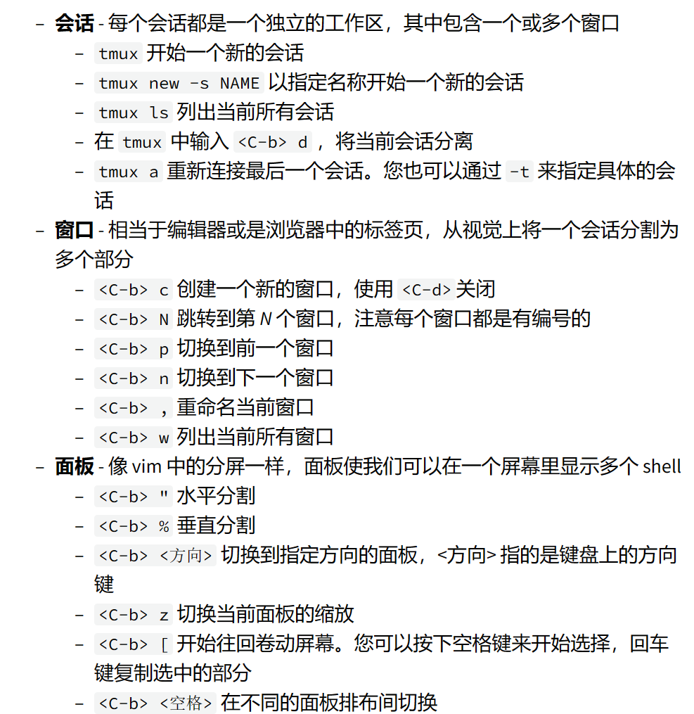

###Unix信号机制

当我们想输入行输入了ctrl-C时，shell会发送一个SIGINT信号到进程。

ctrl-c 和ctrl-/分别代表SIGINT SIGQUIT 都常常用来发出终止程序的请求。

我们可以通过kill-... 来表示SIGTERM  SIGTEM是一个更加通用的，更加优雅的退出信号，我们用kill命令。

ctrl-Z 代表SIGTOP 会暂停程序。我们可以用fg或bg来恢复暂停的工作。

---
### 后台运行

jobs会列出当前终端中没有完成的任务，可以使用 jobs %序号 来选择任务。如果要选择最近的任务，可以使用$!这一参数。

&后缀可以要命令直接在后台运行。
要已经在运行的程序在后台运行，我们可以ctrl-Z暂停它然后bg运行它，这样它就在后台运行了

注意注意：**后台的进程是终端进程的字进程，一旦关闭终端，这些后台程序也会终止**。为了防止这种情况，我们可以**nohup**来忽略SIGHUP的封装。

```
nohup sleep 200

kill -SIGHUP %1 发现无效
```

SIGKILL是一个特殊信号，**它不能被进程捕获，且会马上结束该进程。**

---
###tmux
tmux是线端多路复用器，tmux一旦和屏幕分离，它就会自动后台运行，**并且可以重新连接。对于操作远程机器很有效。**



**需要强调的是每个窗口都有自己独立的shell**

最重要的是，tmux 将这些窗口和窗格保留在会话中。您可以随时退出会话。这称为“分离”。tmux 将保持此会话处于活动状态，直到您终止 tmux 服务器（例如，当您重新启动时）。这非常有用，因为在以后的任何时间点，您只需“附加”到该会话，就可以从离开该会话的位置准确地继续该会话。

---
###alias

alias可以为我们设置别名。用法如下：

 ```
 alias gs="git status"

 alias v="vim"
 ```

需要注意的是：
1. =两边没有空格，alias只接受一个参数。
2. 默认情况下shell不会保存别名，我们需要把别名放在.bashrc或.zshrc等
---
#SSH

ssh可以生成一对密钥，我们只需向远程终端展示我们有私钥，而不需要公开私钥的内容。这样我们就可以避免每次都要输入密码的麻烦了

---
###习题

    kill -0 不会发送信号，但是如过进程结束了，它返回一个不为0 的状态码。其他时候返回0；

就如下面的函数：
```
while kill -0 $1
    do
    sleep 1
done
ls
```
**在shell里whill返回值0表示成功进入循环**


