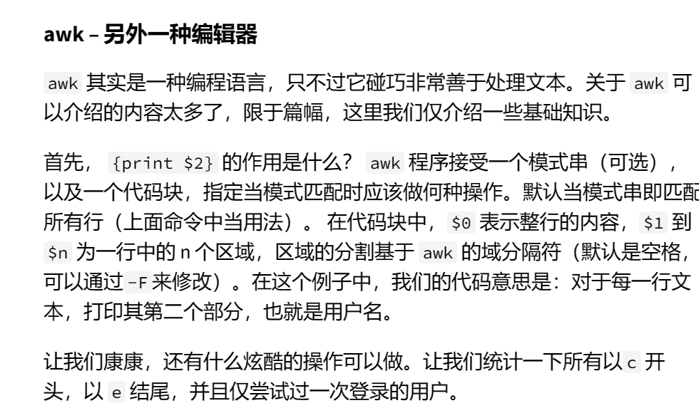

###sed介绍

sed是一个流编辑器。相关的命令特别的多，**最常用的就是s，s命令表示替换**。

例如我们可以这样写
``````bash
sed 's/.*Disconnected from//'
``````

它的基本使用语法是：

    s/正值表达式/替换的东西/

---
##正则表达式

### 基本符号
-   .除换行符以外的任意单个字符
-   *匹配前面的字符零次或多次
-   +匹配前面的字符一次或多次
-   [abc] 匹配abc中的任意一个
-   (RX1|RX2)任何能够匹配RX1和RX2的结果
-   ^行首
-   %行尾
-   [^abc] 将匹配除字母 a、b 或 c 之外的任何单个字符。


回头看这个正则表达式：

```
.*Disconnected from
```

它表示这个正则表达式匹配任何字符串开头，其中包含“Disconnectd from”字符串的字符串。

### 贪婪模式

如果有人恰好将“Disconnected from”当做用户名呢？

正值表达式的* 和 + 一般默认都是贪婪模式，也就是它会尽可能匹配多的文本。会匹配到最后的一个目标。 我们可以在*或+后面加一个？ 来调整为非贪婪模式。 **可惜sed不支持这样做。**

我们在sed中解决这个的办法就是整行匹配。例如：
```
sed -E 's/.*Disconnected form (invalid |authenticating )?user (.*) [^]+ port [0-9] +...'
```
---

###捕获组
但如果我们想保存用户名的话，这样其实已经把所有的值都删掉了。我们就要用捕获组。圆括号内的就是一个捕获组，用/1,/2。

###数据整理

sort可以排序
uniq -c可以折叠重复的，并使用出现次数作为前缀。


###awk



```
awk '$1 == 1 && $2 ~ /^c.*e$/ {print $2}'
```